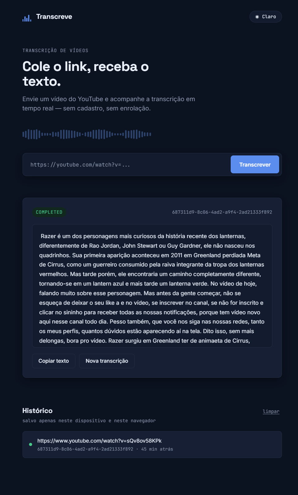

# Transcreve — API de Transcrição de Vídeos

API assíncrona para transcrição de vídeos, construída como estudo prático de **Clean Architecture**, **DDD** e **Ports & Adapters** em Java. Envie um link de vídeo, acompanhe o processamento em tempo real e receba o texto transcrito.

> Projeto pessoal com fins de aprendizado e portfólio.


<!-- [COLE AQUI SCREENSHOT DO FRONT] -->

---

## Como funciona

```
POST /v2/transcriptions
        │
        ▼
   RabbitMQ (fila)
        │
        ▼
     Worker consome
        │
        ▼
  yt-dlp baixa o áudio
        │
        ▼
Faster-Whisper transcreve
        │
        ▼
  Resultado salvo no Postgres
        │
        ▼
GET /v2/transcriptions/{jobId}  →  status + texto
```

O cliente envia o link do vídeo, recebe um `jobId` imediatamente e consulta o status (`PENDING` → `PROCESSING` → `COMPLETED`/`FAILED`) até o resultado ficar pronto. Vídeos com o mesmo conteúdo (identificados por um hash da fonte, o `source_hash`) reaproveitam o resultado já processado, evitando transcrever o mesmo vídeo duas vezes.

---

## Stack

| Camada | Tecnologia |
|---|---|
| Linguagem | Java 21 |
| Framework | Spring Boot 3.5 |
| Banco de dados | PostgreSQL |
| Migrations | Flyway |
| Mensageria | RabbitMQ |
| Cache | Redis |
| Transcrição | Faster-Whisper |
| Download de mídia | yt-dlp |
| Frontend | HTML / CSS / JavaScript puro |
| Build | Maven (multi-módulo) |
| Testes | JUnit 5, Mockito, Testcontainers, MockMvc, Awaitility |

---

## Arquitetura

Modular Monolith organizado em 4 módulos Maven, seguindo Clean Architecture com Ports & Adapters:

```
transcription-api-v2/
├── core/      → domínio e casos de uso — sem dependência de Spring, JPA ou frameworks
├── api/       → aplicação Spring Boot HTTP (controllers, DTOs, configuração web)
├── infra/     → persistência (JPA), mensageria (RabbitMQ), cache (Redis) e migrations Flyway
└── worker/    → aplicação Spring Boot consumidora da fila (yt-dlp + Faster-Whisper)
```

**Regras arquiteturais:**
- `core` não depende de Spring, JPA, RabbitMQ ou Redis
- Dependências sempre apontam para dentro (`api`/`infra`/`worker` → `core`, nunca o inverso)
- DTOs HTTP não entram no domínio; entidades JPA não saem da `infra`
- `api` e `worker` são aplicações Spring Boot independentes, com seu próprio `@SpringBootApplication` — destinadas a rodar como processos/containers separados

**Decisões de domínio:**
- Sem autenticação e sem tabela de usuários (fora do escopo do projeto)
- `source_hash` é o conceito central para deduplicação: jobs referenciam o hash da fonte, evitando reprocessar o mesmo vídeo

---

## Rodando localmente

### Clonando o projeto

```bash
git clone https://github.com/joaopedrooliveir4/video-transcription-api-v2.git
cd video-transcription-api-v2
```

### Pré-requisitos

- Java 21
- Maven
- Docker e Docker Compose
- Python (para o script de transcrição via Faster-Whisper)

### 1. Suba a infraestrutura

```bash
docker compose up -d
```

Isso sobe Postgres, RabbitMQ e Redis localmente, conforme definido no `docker-compose.yml`.

### 2. Configure as variáveis de ambiente

Cada aplicação (`api` e `worker`) precisa de configuração de conexão com o banco, fila e cache. Exemplo (`application.yml` ou variáveis de ambiente):

```
DB_URL=jdbc:postgresql://localhost:5432/transcription
DB_USERNAME=postgres
DB_PASSWORD=sua_senha_aqui

RABBITMQ_HOST=localhost
RABBITMQ_PORT=5672
RABBITMQ_USERNAME=guest
RABBITMQ_PASSWORD=guest

REDIS_HOST=localhost
REDIS_PORT=6379
```

> Ajuste os valores conforme o seu `docker-compose.yml` local. Nenhuma credencial real deve ser commitada — o `.env` já está no `.gitignore`.

### 3. Rode as migrations

As migrations Flyway rodam automaticamente ao subir a `api` (o `worker` roda com `spring.flyway.enabled: false`, já que só a `api` deve gerenciar o schema).

### 4. Suba a API e o Worker

A partir da raiz do projeto:

```bash
mvn spring-boot:run -pl api
```

Em outro terminal:

```bash
mvn spring-boot:run -pl worker
```

### 5. Abra o frontend

O frontend é um HTML estático simples (`index.html` + `styles.css` + `script.js`), sem build step. Basta abrir o `index.html` no navegador — por padrão ele aponta para `http://localhost:8080/v2`.

---

## Endpoints

### `POST /v2/transcriptions`

Cria um novo job de transcrição.

**Request:**
```json
{
  "mediaSource": "https://youtube.com/watch?v=..."
}
```

**Response `201 Created`:**
```json
{
  "jobId": "f47ac10b-58cc-4372-a567-0e02b2c3d479"
}
```

### `GET /v2/transcriptions/{jobId}`

Consulta o status e resultado de um job.

**Response `200 OK`:**
```json
{
  "status": "COMPLETED",
  "text": "texto transcrito do vídeo...",
  "errorMessage": null
}
```

Status possíveis: `PENDING`, `PROCESSING`, `COMPLETED`, `FAILED`.

---

## Testes

Suíte completa de testes automatizados, cobrindo desde unidade de domínio até o fluxo E2E real:

| Camada | Ferramenta | Cobertura |
|---|---|---|
| Domínio (`core`) | JUnit 5 puro | Regras de negócio de `TranscriptionJob` e `TranscriptionResult` |
| Serviço de processamento | Mockito | `TranscriptionProcessorService`, sem Docker |
| Persistência (`infra`) | Testcontainers | Repositórios JPA contra Postgres real |
| API HTTP | MockMvc | Controllers, sem subir infraestrutura |
| Fluxo completo | Testcontainers (Postgres + RabbitMQ + Redis) | API → fila → worker → resultado, com Awaitility |

Rodar todos os testes:

```bash
mvn test
```

---

## Roadmap

- [x] Setup inicial e Docker Compose
- [x] Estrutura Multi-Módulo Maven
- [x] Migrations Flyway
- [x] Camada de domínio
- [x] Casos de uso
- [x] Persistência
- [x] Integração RabbitMQ
- [x] Integração Redis
- [x] API HTTP (criação e consulta de jobs)
- [x] Pipeline do Worker (yt-dlp + Faster-Whisper)
- [x] Deduplicação por `source_hash`
- [x] Suíte de testes automatizados (unitário → E2E)
- [x] Frontend integrado à API real
- [ ] Deploy em produção

---

## Convenções do projeto

- Commits seguem [Conventional Commits](https://www.conventionalcommits.org/), em português, sem acentos
- Branches de feature nascem a partir de `develop` e voltam via fast-forward merge
- Nada é commitado direto em `main`

---

## Licença

Projeto pessoal de estudo — sem licença formal definida.